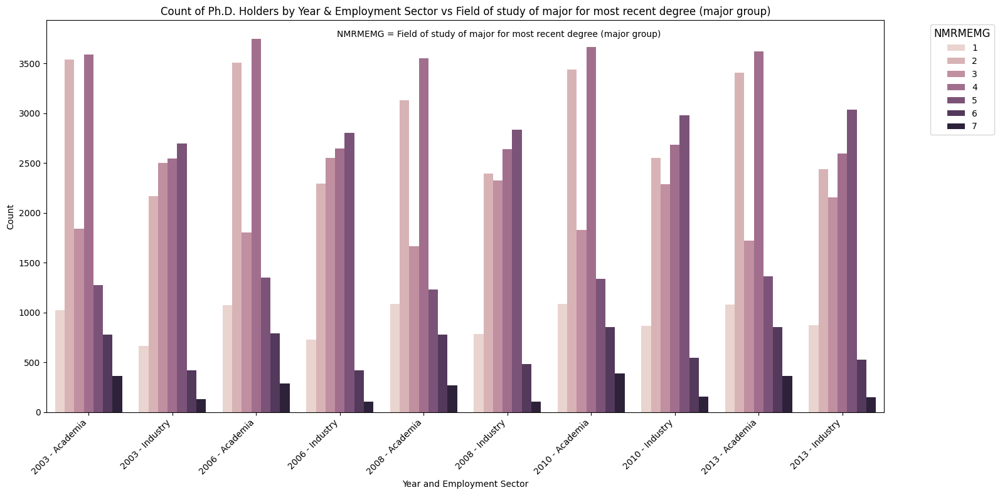
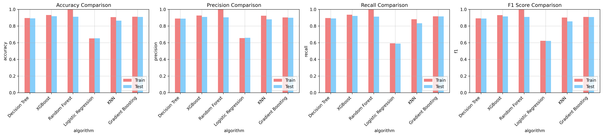
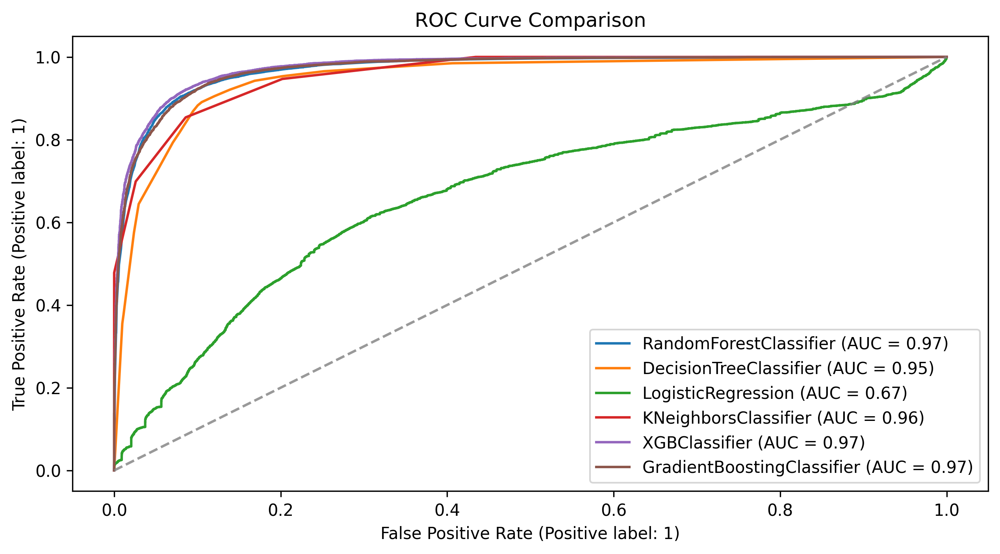
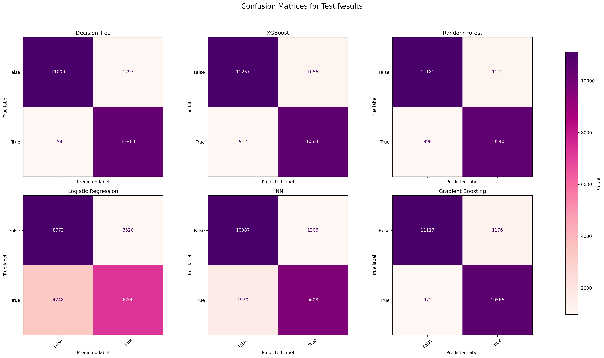
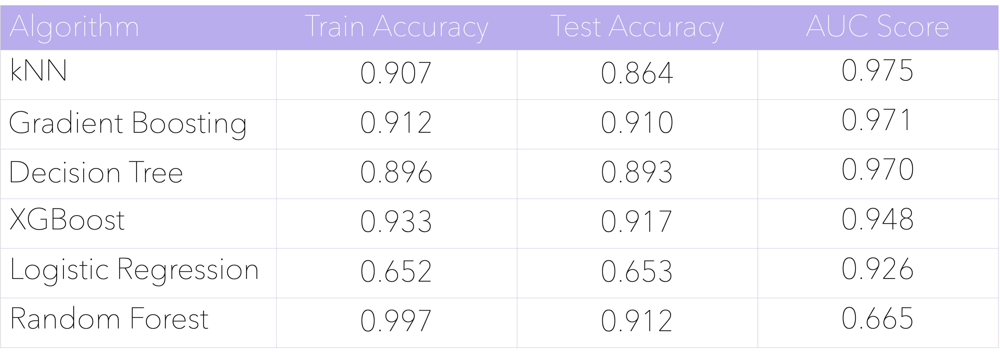
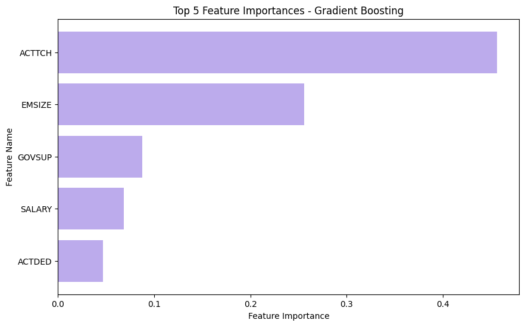
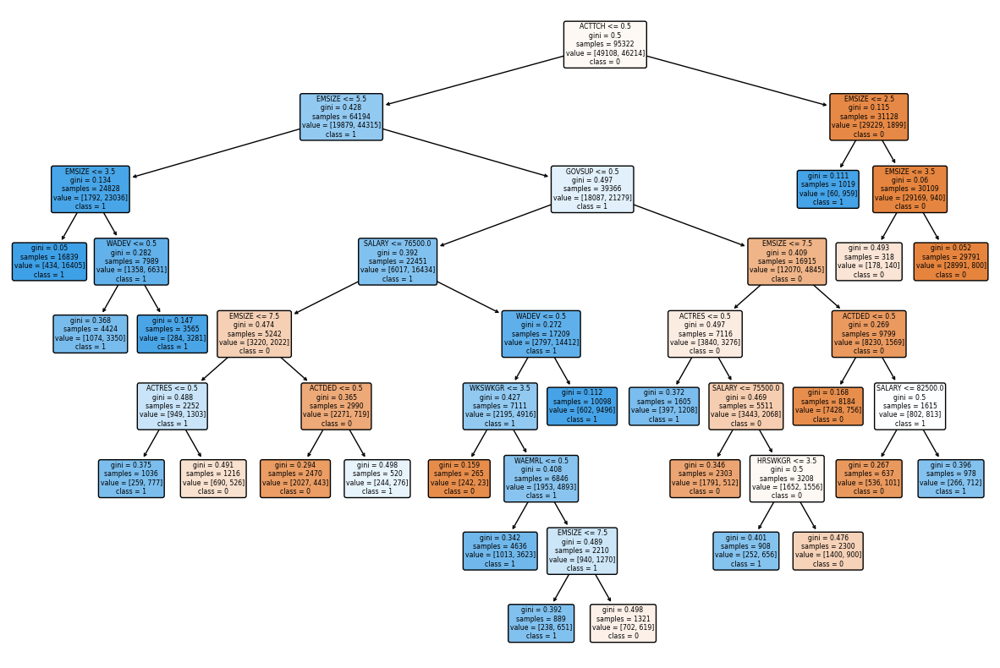

# CS668-Capstone-Project

Repository for storing code for my MS in Data Science course CS668 Capstone Project at Pace University. 

**Course Description:** The purpose of the Analytics Capstone Project is for students to apply the knowledge and skills acquired during their master's program to a project involving actual data in a real world setting. During the project, students will apply the entire data science process from identifying a problem or opportunity and collecting and processing actual data to applying suitable and appropriate analytic methods to find a solution. Both the problem statement for the project and the datasets will come from real-world domains similar to those that students might typically encounter within industry, government, or academic research. The course will culminate with each student making a presentation and submitting a final poster/paper and an associate notebook or code.

## Table of Contents
- [Important Links](#important-links)
- [Research Question](research-question)

## Important Links
- [Link to class Google Sheets](https://docs.google.com/spreadsheets/d/1oHmrpW2VqZPuhs3KfzjCWYPrM9RZhGllY99PErwfoEA/edit#gid=6770168)
- [Link to progress document](https://docs.google.com/presentation/d/1SxkY7UzO3wcA3xyFD9Zda812X8YGjOuhNamX-klG0rg/edit?usp=sharing)
  
([back to top](#table-of-contents))

## Abstract

After obtaining a Ph.D. degree, there are many career paths open to graduates. There is existing literature analyzing these post-Ph.D. career trends using statistical methods and social science frameworks, but there remains a gap in leveraging data science methods to address these questions. In this study, we employ data science and machine learning models to analyze the IPUMS Higher Ed survey dataset spanning 2003 - 2013, focusing on the U.S. STEM workforce. Our analysis centers on understanding the factors influencing Ph.D. graduates in choosing between academia and industry. We utilize six binary classification models to predict the employment sector of these graduates and employ feature engineering methods to identify the characteristics influencing their decision. This research contributes to the field by demonstrating applications of computational methods, particularly machine learning, to streamline and enhance the research process.

Keywords: *machine learning; binary classification; feature extraction; feature engineering; exploratory data analysis; data science*

([back to top](#table-of-contents))

## Research Question
Can we predict the employment sector (academia vs. industry) of Ph.D. degree holders and identify the key characteristics influencing this career choice?

([back to top](#table-of-contents))

## Literature Review
- Most studies in the field use frameworks and statistical models to explain job satisfaction (Dorenkamp & Weiß, 2017), intention to leave the higher education sector (Dorenkamp & Weiß, 2017, Szromek & Wolniak, 2020), turnover rates (White-Lewis et al., 2022, Xu, 2008), etc.
- Very few studies use machine learning techniques to predict attributes that cause turnover (Birzniece et al., 2022).
- Another study (Makridis, 2021) that used the IPUMS Higher Ed dataset also used statistical models to perform their analysis.
- Sheetal et al., 2022 uses a similar longitudinal survey dataset and apply machine learning models like XGBoost to find the most important predictor variables.
- Dorenkamp & Weiß, 2017 found that postdocs tend to leave academia because of effort-reward imbalance and professional overcommitment, Szromek & Wolniak, 2020 found that researchers are dissatisfied because of lack of recognition, increased workload without compensation, and more. White-Lewis et al., 2022 found that researchers leave because of faculty and tenure status factors. Xu, 2008 found that women are more likely to leave STEM academic careers due to reasons like dissatisfaction with research support, advancement opportunities, and free expression of ideas.

([back to top](#table-of-contents))

## Dataset

[IPUMS Higher Education](https://highered.ipums.org/highered/index.shtml) is a longitudinal survey dataset covering the U.S. STEM workforce from 2003 to 2013, comprising 531,216 rows and 126 columns. 

We wrote a script to create a data dictionary for the coded feature names and values. 

We filtered the dataset to only include respondents who have earned Ph.D. degrees, who were full-time employed, and who work in either academia (defined as a 4-year college/medical institution), or industry. 

We performed an extensive investigation into the features and their correlations to downsize the dataset size, given its multidimensionality.

([back to top](#table-of-contents))

## Methodology

Given the original dataset size (531,216 x 126), we performed extensive exploratory data analysis (EDA) to understand the data. We checked for null and missing values, checked the correlations of the features, and ensured the data was numerical. From this EDA, we identified the relevant features for answering the research question and filtered the data accordingly (MRDG = 3, EMSEC = (2,4), LFSTAT = 1, WRKG = 1). 

We then examined each of the 126 variables by year and employer sector, and using statistical correlations and domain knowledge, discarded 103 features for a final dataset size of (119153 x 23). 

(caption) An example of the EDA process. Each feature, in this case NMRMEMG (field of major), was visualized by year and employment sector, to investigate any trends, and to determine whether to discard the feature. Downsampling was necessary due to the high dimensionality of the dataset.

We split our dataset 80% train and 20% test, and identified 7 binary classification algorithms to classify our dataset using our target variable EMSEC, and its value (academia = 0, industry = 1), namely: 

- Decision Tree
- XGBoost
- Support Vector Machine
- Random Forest
- Logistic Regression
- k-Nearest Neighbors
- Gradient Boosting

We obtained feature importances for each algorithm, and evaluated the best-performing models using metrics like: 

- confusion matrices
- accuracy
- precision
- recall
- F1 score
- ROC-AUC score

(caption) Visualization of tech stack used for project.

([back to top](#table-of-contents))

## Results

We found that we had hardware constraints, which meant we could not run the Support Vector Machine model. Regardless, we ran the other 6 models to predict the class of EMSEC as either ‘industry’ or ‘academia’. We extracted the feature importances from each model, and evaluated the model performance along several metrics: accuracy, precision, recall, F1-score, confusion matrices, and ROC/AUC curves. 

(caption) Classification model evaluation metrics for all 6 algorithms, with train and test comparisons.

(caption) ROC curve for all 6 algorithms. Logistic Regression is the worst performer.

(caption) Confusion matrices for all 6 algorithms. Logistic Regression is the worst performer.

(caption) Final evaluation of all 6 models, using accuracy and ROC score as metrics.

Based on extensive analysis of these metrics, and using domain knowledge as guidance, we found the top three models, in order, to be: 

1. Gradient Boosting
2. XGBoost
3. Decision Tree

From all three models' feature importances, we found the top three factors in classification as either industry or academia are: 

1. Teaching activity 
2. Employer size
3. Federal government support

Other factors include salary and development activity. Due to hardware constraints, we were not able to perform any hyperparameter tuning.

(caption) Key features ranked by importance, determined through the Gradient Boosting method.

([back to top](#table-of-contents))

## Conclusion and Future Work

We used the longitudinal IPUMS Higher Ed survey dataset to analyze employment trends of PhD graduates, and factors that influence their decisions to work in either industry or academia. We performed a comprehensive investigation of the data and its features to reduce its dimensionality, and used six binary classification algorithms to predict survey respondents’ employment sectors as either industry or academia. We extracted the most relevant features pertaining to each class, and determined that teaching activity, employer size, and federal support were the most important divisors of either class. 

We demonstrated the usage of data science and machine learning methods to solve a problem in the social science domain, as compared to traditional statistical analyses. 

Limitations include implicit feature boundaries rather than explicit decision boundaries, lack of hyperparameter tuning due to hardware constraints, and lack of using statistical frameworks in literature to supplement analysis. 

(caption) Decision Tree visualized.

Future work includes robustly finding the most optimal model with hyperparameter tuning, fine-tuning the feature engineering and extraction process, and using these data science methods in conjunction with the existing statistical methods and social science frameworks.

([back to top](#table-of-contents))

## Bibliography

- I. Dorenkamp and E.-E. Weiß, “What makes them leave? A path model of postdocs’ intentions to leave academia,” High Educ, vol. 75, no. 5, pp. 747–767, May 2018, doi: 10.1007/s10734-017-0164-7.
- A. R. Szromek and R. Wolniak, “Job Satisfaction and Problems among Academic Staff in Higher Education,” Sustainability, vol. 12, no. 12, Art. no. 12, Jan. 2020, doi: 10.3390/su12124865.
- D. K. White-Lewis, K. O’Meara, K. Mathews, and N. Havey, “Leaving the Institution or Leaving the Academy? Analyzing the Factors that Faculty Weigh in Actual Departure Decisions,” Res High Educ, vol. 64, no. 3, pp. 473–494, May 2023, doi: 10.1007/s11162-022-09712-9.
- Y. J. Xu, “Gender Disparity in STEM Disciplines: A Study of Faculty Attrition and Turnover Intentions,” Res High Educ, vol. 49, no. 7, pp. 607–624, Nov. 2008, doi: 10.1007/s11162-008-9097-4.
- C. A. Makridis, “(Why) Is There a Public/Private Pay Gap?,” Journal of Government and Economics, vol. 1, p. 100002, Mar. 2021, doi: 10.1016/j.jge.2021.100002.
- I. Birzniece, I. Andersone, A. Nikitenko, and L. Zvirbule, “Predictive Modeling of HR Dynamics Using Machine Learning,” in 2022 7th International Conference on Machine Learning Technologies (ICMLT), Rome Italy: ACM, Mar. 2022, pp. 17–23. doi: 10.1145/3529399.3529403.
- R. Zebari, A. Abdulazeez, D. Zeebaree, D. Zebari, and J. Saeed, “A Comprehensive Review of Dimensionality Reduction Techniques for Feature Selection and Feature Extraction,” Journal of Applied Science and Technology Trends, vol. 1, no. 2, Art. no. 2, May 2020, doi: 10.38094/jastt1224.
- A. Sheetal, Z. Jiang, and L. Di Milia, “Using machine learning to analyze longitudinal data: A tutorial guide and best-practice recommendations for social science researchers,” Applied Psychology, vol. 72, no. 3, pp. 1339–1364, 2023, doi: 10.1111/apps.12435.

([back to top](#table-of-contents))
